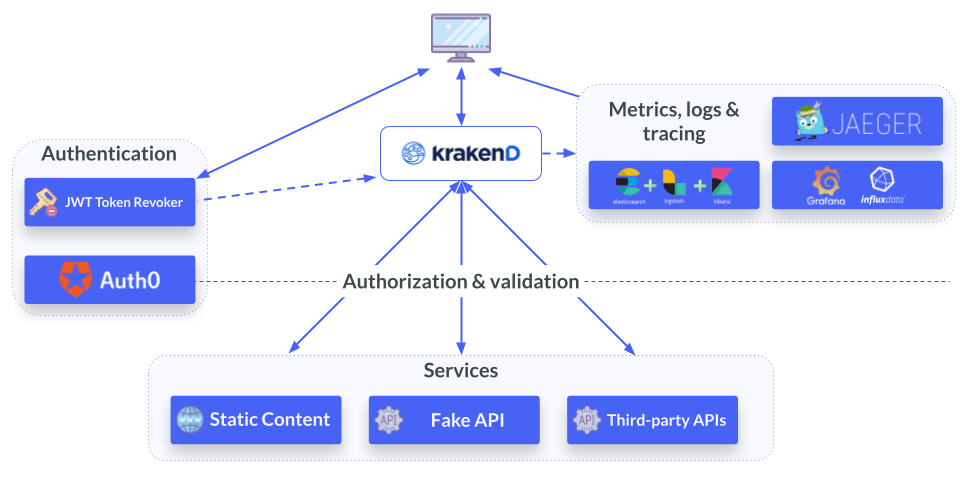

# KrakenD Enterprise Playground

 | _Note:_ **This playground require a valid KrakenD Enterprise license file placed in `/config/krakend/LICENSE`.** |
| --- |

· _[Request a KrakenD EE demo or a trial license »](https://www.krakend.io/enterprise/#contact-sales)_ \
· _See the [open-source edition of a similar environment »](https://github.com/devopsfaith/krakend-playground)_

The KrakenD Enterprise Playground is a demonstration environment that puts together the necessary pieces to get you started with our API Gateway, using some example use cases.

As KrakenD is an API gateway, we have added:
- some internal and third-party services that feeds the gateway
- several authentication / authorization examples, including JWT token based authentication with Auth0 integration and a jkt token revoker, API-Key based authentication and Basic Authentication. 
- some static assets that will be served by embeded KrakenD Static Server
- some example integrations with Grafana+Influx (metrics), ELK (log storing and visualization) and Jaeger (tracing).



## Services
The docker-compose.yml includes the following services:

### The API Gateway!
An instance of KrakenD with several endpoints. Its configuration is available at `config/krakend/krakend.json`, including some descriptive comments on every endpoint.

Runs on [http://localhost:8080](http://localhost:8080) \
Running on [http://localhost:8080/demo/](http://localhost:8080/demo/) you'll find a [static website served by KrakenD](https://www.krakend.io/docs/enterprise/endpoints/serve-static-content/) itself.

### Fake API
A simple API that provides raw data to the gateway. You can add or remove data any time by adding XML, JSON or RSS files in the `data` folder.

Runs on [http://localhost:8000](http://localhost:8000)

### Metrics, logs & tracing
A Jaeger dashboard shows the traces of the activity you generate.
Runs on [http://localhost:16686](http://localhost:16686)

A Kibana dashboard shows the logs registered by Logstash and persisted in Elasticsearch.
Kibana runs on [http://localhost:5601](http://localhost:5601)

A Grafana dashboard shows the metrics registered at InfluxDB
Grafana runs on [http://localhost:4000](http://localhost:4000)

### The JWT revoker
A simple implementation of a JWT rovoker using the KrakenD remote bloomfilter client.

Runs on [http://localhost:9000](http://localhost:9000)

### Web client
This consumer of the API gateway is a simple Express JS application that interacts with KrakenD to fetch the data. All code is under `web/`.

The client is a Single Page Application using [Auth0](https://auth0.com) to generate JWT tokens.

**You don't need to install any npm locally**, the docker image will download and install the dependencies in the container for you.

Runs on [http://localhost:3000](http://localhost:3000)

## Start the service

### Only if you want to try the Auth0 integration...
Create a new SPA application in [Auth0](https://manage.auth0.com/) and fill the autogenerated values they give you under `web/auth0-variables.js`

    var AUTH0_CLIENT_ID='AUTH0_CLIENT_ID';
    var AUTH0_DOMAIN='AUTH0_DOMAIN';
    var AUTH0_AUDIENCE = 'AUTH0_AUDIENCE';

This must be done before starting the docker-compose.
If you have started docker-compose before setting these variables, you need to build the image again with `docker-compose build web`.

### Running the playground

To start the stack included in docker-compose
```shell
    $ make start
```

To follow the KrakenD logs after the complete stack is up & running
```shell
    $ make logs
```

To shut down the complete stack, removing all the volumes
```shell
    $ make stop
```

## Play!
Fire up your browser, curl, postman, httpie or anything else you like to interact with any of the published services.

- Demo static website: [http://localhost:8080/demo/](http://localhost:8080/demo/)
- Fake API: [http://localhost:8000](http://localhost:8000)
- KrakenD API Gateway: [http://localhost:8080](http://localhost:8080)
- Jaeger (tracing): [http://localhost:16686](http://localhost:16686)
- Kibana (logs): [http://localhost:5601](http://localhost:5601)
- Grafana (metrics): [http://localhost:4000](http://localhost:4000)
- JWT revoker: [http://localhost:9000](http://localhost:9000)
- Web: [http://localhost:3000](http://localhost:3000)

## Editing the API Gateway endpoints
To add or remove endpoints, edit the file `krakend/krakend.json`. The easiest way to do it is by **dragging this file to the [KrakenD Designer](https://designer.krakend.io/)** and download the edited file. To reflect the changes restart with `make restart`.

To change the data in the static server (simulating your backend API) edit, add or delete files in the **`data/`** folder.

The following endpoints are worth noticing:

- **Data aggregation and manipulation**: `/git/{user}`: Aggregating and transforming data from Git API
- **Concurrent requests**: `/market/concurrent`: Using [concurrent requests](https://www.krakend.io/docs/endpoints/concurrent-requests/) to gather data from Coingecko API
- **Wildcards**: `/fake-api/{*}`: Expose information from internal service at fake api using wildcard
- **Basic authentication**: `/fake-api-auth/{*}`: Expose information from internal service at fake api using wildcard and adding Basic Authentication
- **Geolocation / Geofencing**: `/fake-api-geofence/{*}`: Expose information from internal service at fake api using wildcard and appying geofencing (only accesible ) \
  _Note: to use geofencing, you should download a [Maxmind GeoIP City database](https://dev.maxmind.com/geoip/geolite2-free-geolocation-data?lang=en) (commercial or free) on store on `config/krakend/geoip/`_
- **Authentication**: `/private/auth0`: Protects and endpoint validating JWT tokens issued by Auth0

You will find more examples with comments in `config/krakend/krakend.json`

---

If you have any questions or doubt, you can find our support resources at [https://www.krakend.io/support/](https://www.krakend.io/support/)

**Interested in a demo or a trial license of KrakenD Enterprise?** [Write us »](https://www.krakend.io/enterprise/#contact-sales)
